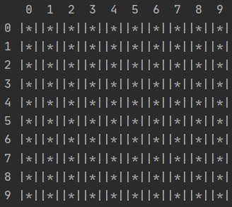
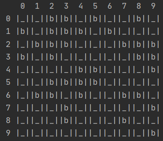
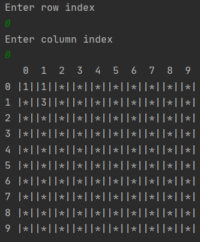

#Minesweeper

##Описание 
Консольная игра сапер с рекурсивным поиском

###Детали реализации
В игре использован рекурсивный поиск свободных ячеек, смежных с той, которую открыл
 пользователь. Свободной считается ячейка, вокруг которой нет 
ни одной мины. Таким образом, при открытии пустой ячейки открывается множество свободных смежных с ней ячеек.

Также реализован функционал, когда возле ячейки с миной проставляется цифра - количество мин вокруг.

Игра заканчивается, когда все мины открыты, либо, если игрок открыл ячейку с миной.

При запуске игры выводится два поле: закрытое (поле игрока) и открытое (для тестирования, чтобы видеть все мины)

#### Внешний вид закрытого поля 

#### Внешний вид открытого поля 

#### Внешний вид игрового поля после открытия ячейки 0-0
